# MVP de Engenharia de Dados - Sistemas de Potência de CubeSats em Órbita
**Aluno:** Alexandre Domingues Caspechaque

**Curso:** Pós-Graduação em Ciência de Dados e Analytics (Sprint de Engenharia de Dados) - PUC-RJ

---

## Sumário

1. [Contexto de Negócio e Perguntas (Etapas 2 e 4.1)](#1-contexto-de-negócio-e-perguntas-etapas-2-e-41)
2. [Carga dos Dados (Etapa 4.2)](#2-carga-dos-dados-etapa-42)
3. [Modelagem e Catálogo de Dados (Etapa 4.3)](#3-modelagem-e-catálogo-de-dados-etapa-43)
4. [Pipeline de Dados (Etapa 4.4)](#4-pipeline-de-dados-etapa-44)
5. [Qualidade de Dados (Etapa 4.5)](#5-qualidade-de-dados-etapa-45)
6. [Análise de Dados (Etapa 4.5)](#6-análise-de-dados-etapa-45)
7. [Autoavaliação](#7-autoavaliação)

---

## 1. Contexto de Negócio e Perguntas (Etapas 2 e 4.1)

**Introdução:**

O CubeSat é um tipo padronizado de satélite pequeno, construído a partir de módulos cúbicos de 10x10x10 cm. Este padrão foi criado por volta de 1999 para estudantes poderem construir e lançar satélites de verdade gastando pouco. Como o formato é padronizado, eles viajam "de carona" em lançamentos maiores ou são soltos da Estação Espacial Internacional (ISS), o que reduz muito o seu custo. Em um CubeSat, são monitoradas cinco faces (denotadas por +X, +Y, +Z, -X, -Z), cada uma com um painel solar, e há uma bateria que guarda energia para os períodos sem incidência solar (eclipses: quando o satélite passa pela sombra da Terra, o que acontece a cada aproximadamente 90 minutos em órbitas de baixa altitude).

Para este projeto foi utilizado o dataset *"On-orbit Electrical Power System Dataset of 1U CubeSat constellation for Machine Learning Models"*, com medidas do programa BIRDS, um projeto liderado pelo Kyushu Institute of Technology (Kyutech, Japão) em que estudantes de vários países constroem juntos o primeiro satélite dos seus países. O dataset traz a telemetria de quatro satélites: TSURU, RAAVANA, UGUISU e NEPALISAT. Dois deles, UGUISU e RAAVANA, tiveram falha documentada em painel solar.

**Problema:**

A equipe de operação em solo de uma constelação de CubeSats precisa acompanhar a saúde do subsistema de potência elétrica (EPS) dos satélites em órbita. Como nada pode ser consertado depois do lançamento, é essencial saber se a telemetria de painéis e baterias permite identificar degradação e falhas a tempo de apoiar decisões operacionais, como ajustar o consumo de energia, redistribuir tarefas entre satélites ou planejar o fim da missão.

**Perguntas de Negócio:**
1. Como a tensão e a corrente dos painéis variam ao longo da órbita e ao longo da vida útil do satélite?
2. É possível identificar nos dados o momento da falha do painel solar (UGUISU e RAAVANA)? Quais sinais antecedem essas falhas?
3. Como se compara o desempenho do sistema de potência entre os quatro satélites?
4. Há degradação progressiva da bateria ao longo do tempo em órbita?
5. Qual das cinco faces do satélite contribui mais para a geração de energia de forma consistente ao longo da órbita?

### Dados Brutos e Licença

**Fonte:** JARA, Adolfo; LEPCHA, Pooja. *On-orbit Electrical Power System Dataset of 1U CubeSat constellation for Machine Learning Models*. Mendeley Data, versão 1, 27 maio 2022. DOI: [10.17632/8kp25ycf63.1](https://doi.org/10.17632/8kp25ycf63.1). Disponível em: https://data.mendeley.com/datasets/8kp25ycf63/1.

**Licença:** CC BY 4.0 (Creative Commons Atribuição 4.0 Internacional). Permite usar, redistribuir e adaptar os dados para qualquer finalidade, inclusive acadêmica, desde que os autores originais sejam citados. Neste trabalho, a atribuição é feita pela referência acima.

**Contexto:** o dataset reúne a telemetria do subsistema de potência elétrica (EPS) coletada em órbita pelos quatro CubeSats 1U. Segundo a descrição dos autores, os satélites foram lançados a partir da ISS (órbita de ~400 km de altitude, inclinação de 51,6° e período orbital de 92,6 min). O computador de bordo registra as medições a cada 90 segundos em operação normal, ou a cada 10 segundos no modo de amostragem rápida, e os operadores da estação em solo baixam esses dados da memória do satélite. Cada sessão de coleta (aba da planilha) corresponde a um desses períodos registrados. As datas das sessões vão de outubro de 2020 a janeiro de 2022.

Datas de lançamento relevantes para a análise: RAAVANA, UGUISU e NEPALISAT (projeto BIRDS-3) foram liberados da ISS em **17/06/2019**, e o TSURU (BIRDS-4) em **14/03/2021**. Ou seja, os dados do BIRDS-3 começam mais de um ano depois do lançamento, enquanto os do TSURU começam duas semanas depois.

**Estrutura dos arquivos brutos:**

- Um arquivo Excel (`.xlsx`) por satélite: `TSURU.xlsx`, `RAAVANA.xlsx`, `UGUISU.xlsx` e `NEPALISAT.xlsx`;

- Dentro de cada arquivo, cada aba é uma sessão de coleta, nomeada pela data da coleta. O TSURU tem ainda abas de teste em solo (`Test1 w batt`, `Test2 wo batt`), feitas antes do lançamento.

Cada aba tem 37 colunas:

| Grupo | Colunas | Unidade (calibrado) |
|---|---|---|
| Tempo | `Time Stamp` (segundos desde o início da sessão) | s |
| Painéis solares (5 faces: +X, +Y, +Z, -X, -Z) | temperatura, tensão e corrente de cada face | °C, mV, mA |
| Bateria | tensão, corrente (bidirecional: carga/descarga) e temperatura | V, mA, °C |

Cada medida de painel e de bateria aparece duas vezes: o valor bruto em hexadecimal, como foi transmitido pelo satélite, e o valor calibrado em unidade física (5 faces × 3 medidas × 2 + 3 medidas de bateria × 2 + 1 coluna de tempo = 37 colunas).

## 2. Carga dos Dados (Etapa 4.2)

A plataforma utilizada foi o Databricks Free Edition, com o Unity Catalog para organizar os dados. Foi criado o catálogo `cubesat_eps` com três schemas, um para cada camada da arquitetura Medallion:

| Schema | Camada | Conteúdo |
|---|---|---|
| `bronze` | Bronze | Arquivos brutos, exatamente como baixados da fonte |
| `prata` | Prata (Silver) | Tabela consolidada e padronizada |
| `ouro` | Ouro (Gold) | Modelo dimensional (floco de neve) pronto para análise |

Os quatro arquivos originais (`TSURU.xlsx`, `RAAVANA.xlsx`, `UGUISU.xlsx`, `NEPALISAT.xlsx`) foram baixados do Mendeley Data e enviados, sem nenhuma alteração, para o Volume `raw_files` do schema `bronze`, pela interface do Databricks (Catalog Explorer → Upload to volume). Com isso, eles ficaram disponíveis no caminho:

`/Volumes/cubesat_eps/bronze/raw_files/`

A camada Bronze foi mantida como arquivos, não como tabela. Como o formato original é Excel com várias abas por arquivo, a leitura e a consolidação exigem lógica de transformação (percorrer abas, extrair a data do nome da aba, remover linhas em branco), e isso foi feito na etapa seguinte do pipeline (na seção 4). Guardar os arquivos intactos preserva a rastreabilidade: qualquer resultado das camadas seguintes pode ser conferido contra o dado original.

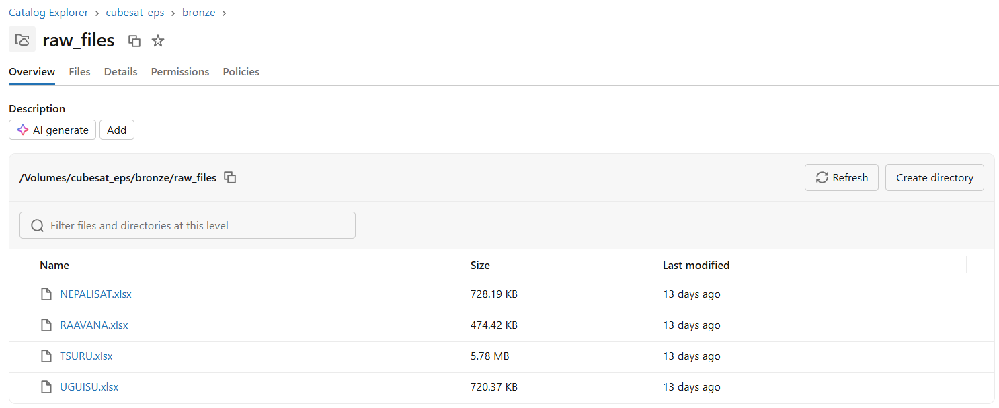

*Figura 1: Volume `bronze.raw_files` no Catalog Explorer, com os 4 arquivos brutos.*

## 3. Modelagem e Catálogo de Dados (Etapa 4.3)

### Camada Prata: tabela consolidada

A camada prata tem uma única tabela, `cubesat_eps.prata.eps_telemetria`, que reúne todas as leituras dos 4 satélites (todas as abas dos 4 arquivos) em formato tabular plano: 32.837 linhas e 42 colunas. Ela não segue um modelo dimensional: seu papel é ser a versão limpa, padronizada e auditável dos dados brutos, servindo de fonte para a camada ouro.

As 42 colunas se dividem em:
- 37 colunas de dados: a coluna de tempo e as 18 medidas dos sensores, cada uma em duas versões, o valor bruto (`_raw`, em hexadecimal, como texto) e o valor calibrado (em unidade física);
- 5 colunas de controle: adicionadas na consolidação para identificar a origem de cada leitura (`satellite_id`, `sheet_name`, `sheet_date`, `is_ground_test`, `source_file`).

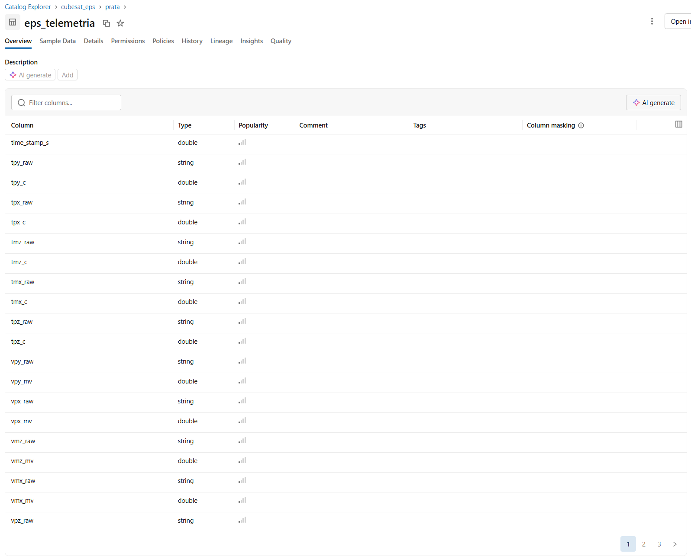

*Figura 2: Tabela `prata.eps_telemetria` persistida no Unity Catalog (primeira página de colunas).*

### Modelo de Dados (Camada Ouro)

Para a camada ouro foi adotado um modelo dimensional, com uma tabela fato central e duas dimensões. Como a `dim_satelite` se relaciona com a fato por meio da `dim_sessao`, o modelo é um floco de neve (snowflake) simples. Essa escolha segue a hierarquia natural dos dados: cada leitura pertence a uma sessão, e cada sessão pertence a um satélite. Assim, as informações do satélite não precisam ser repetidas em cada sessão.

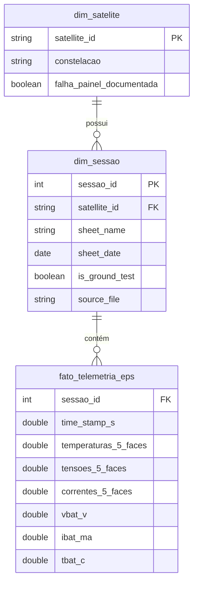

| Tabela | Tipo | Granularidade | Linhas |
|---|---|---|---|
| `fato_telemetria_eps` | Fato | Uma leitura de telemetria, por satélite, por instante, por sessão | 32.837 |
| `dim_sessao` | Dimensão | Uma sessão de coleta (aba da planilha original) | 50 |
| `dim_satelite` | Dimensão | Um satélite | 4 |

**Decisões de modelagem:**

- Chave substituta em `dim_sessao`: `sessao_id` é gerado com `row_number()` em ordem determinística (satélite, data, nome da aba), então os IDs são os mesmos a cada reexecução. A chave natural é o par `(satellite_id, sheet_name)`: o nome da aba sozinho não é garantidamente único entre satélites, embora não haja colisão neste dataset.

- Apenas valores calibrados na fato: as colunas `_raw` (hexadecimais) ficaram só na prata, para auditoria. Na ouro ficam apenas as grandezas físicas usadas na análise.

- `falha_painel_documentada` em `dim_satelite`: marca RAAVANA e UGUISU e permite filtrar ou comparar satélites com falha conhecida diretamente pela dimensão.

- Frames de bateria corrompidos: 8 leituras com `vbat_v`, `ibat_ma` e `tbat_c` inválidos tiveram só essas 3 colunas anuladas (NULL) na fato. As leituras de painel das mesmas linhas continuam válidas (detalhes na seção 5).

A integridade referencial foi verificada com `LEFT ANTI JOIN` nos dois relacionamentos (fato → dim_sessao e dim_sessao → dim_satelite): nenhum registro órfão.

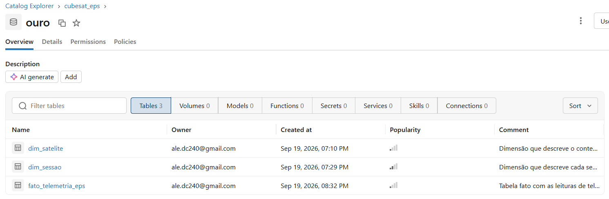

*Figura 3: As 3 tabelas do schema `ouro` persistidas no Unity Catalog, com as descrições registradas.*

### Catálogo de Dados

O catálogo da camada ouro foi registrado diretamente no Unity Catalog, com comentários de tabela (`COMMENT ON TABLE`) e de coluna (`ALTER TABLE ... ALTER COLUMN ... COMMENT`). A transcrição abaixo foi extraída de `information_schema.tables` e `information_schema.columns`. Os valores de domínio das colunas numéricas foram calculados sobre os dados (mínimo e máximo reais), não estimados.

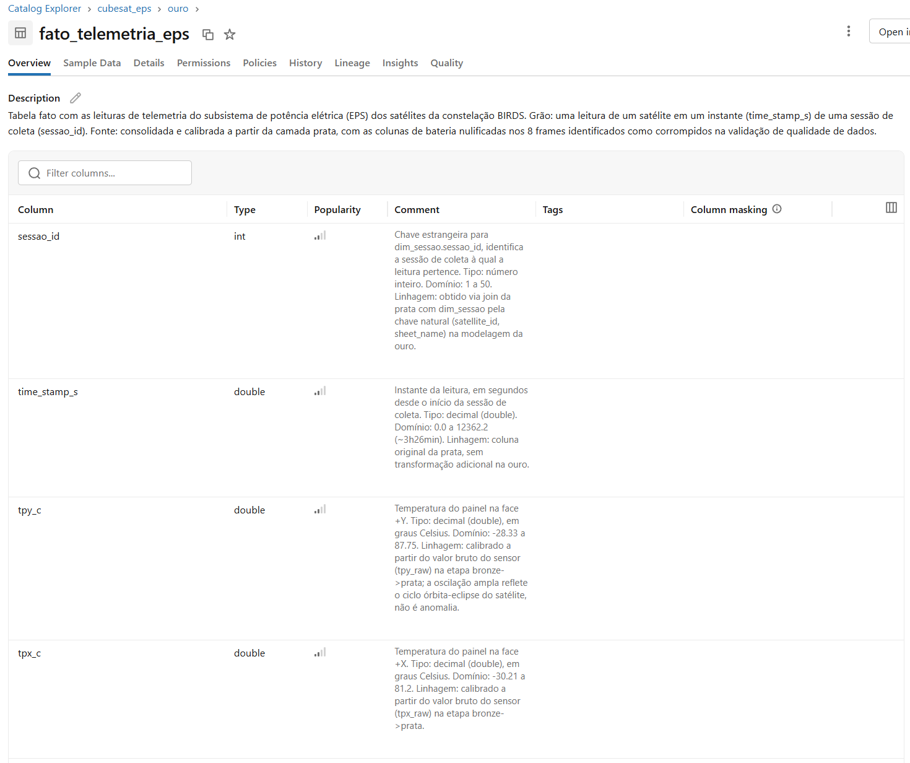

*Figura 4: Recorte do catálogo da `fato_telemetria_eps` no Catalog Explorer: descrição da tabela e, por coluna, tipo, domínio e linhagem.*

#### `prata.eps_telemetria`

| Coluna(s) | Tipo | Descrição | Domínio | Linhagem |
|---|---|---|---|---|
| `time_stamp_s` | double | Instante da leitura, em segundos desde o início da sessão | 0,0 a 12.362,2 | Coluna `Time Stamp` do Excel |
| `tpy_c`, `tpx_c`, `tmz_c`, `tmx_c`, `tpz_c` | double | Temperatura do painel de cada face (°C) | ≈ -32 a 92 | Valor calibrado do Excel |
| `vpy_mv`, `vpx_mv`, `vmz_mv`, `vmx_mv`, `vpz_mv` | double | Tensão do painel de cada face (mV) | 0 a ≈ 5.711 | Valor calibrado do Excel |
| `ipy_ma`, `ipx_ma`, `imz_ma`, `imx_ma`, `ipz_ma` | double | Corrente do painel de cada face (mA) | 0 a ≈ 541 | Valor calibrado do Excel |
| `vbat_v`, `ibat_ma`, `tbat_c` | double | Tensão (V), corrente (mA; + carga, − descarga) e temperatura (°C) da bateria | como na fato, mas incluindo os 8 frames corrompidos (ex.: `vbat_v` de 0 a 6,44) | Valor calibrado do Excel |
| `*_raw` (18 colunas) | string | Valor bruto de cada medida acima, em hexadecimal, como transmitido pelo satélite | texto hexadecimal | Coluna bruta do Excel, convertida para texto na consolidação |
| `satellite_id` | string | Satélite de origem | NEPALISAT, RAAVANA, TSURU, UGUISU | Nome do arquivo `.xlsx` |
| `sheet_name` | string | Nome da aba (sessão de coleta) | texto livre (datas e rótulos de teste) | Nome da aba do Excel |
| `sheet_date` | date | Data da sessão | 2020-10-23 a 2022-01-24; nulo nos testes em solo | Extraída de `sheet_name` por `parse_sheet_date()` |
| `is_ground_test` | boolean | Indica sessão de teste em solo | true / false | Derivada de `sheet_name` |
| `source_file` | string | Arquivo de origem | 4 nomes de arquivo `.xlsx` | Nome do arquivo lido do volume |

Prefixos de face: `py` = +Y, `px` = +X, `pz` = +Z, `mx` = −X, `mz` = −Z.

#### `ouro.dim_satelite`

Dimensão que descreve o contexto fixo de cada satélite da constelação BIRDS. Grão: um satélite por linha. Fonte: construída manualmente com conhecimento de domínio do projeto (não derivada da telemetria).

| Coluna | Tipo | Descrição | Domínio | Linhagem |
|---|---|---|---|---|
| `satellite_id` | string | Identificador do satélite (chave primária) | NEPALISAT, RAAVANA, TSURU, UGUISU | Nome do arquivo Excel de origem na bronze |
| `constelacao` | string | Constelação à qual o satélite pertence | "BIRDS" (valor único) | Atribuído manualmente com base na documentação do dataset |
| `falha_painel_documentada` | boolean | Indica falha de painel solar documentada na literatura da missão | true (RAAVANA, UGUISU); false (NEPALISAT, TSURU) | Atribuído manualmente com base em documentação externa da missão BIRDS |

#### `ouro.dim_sessao`

Dimensão que descreve cada sessão de coleta de telemetria (uma aba da planilha original de um satélite). Grão: uma sessão por linha. Fonte: derivada da camada prata, com chave substituta gerada na modelagem da ouro.

| Coluna | Tipo | Descrição | Domínio | Linhagem |
|---|---|---|---|---|
| `sessao_id` | int | Chave substituta da sessão (chave primária) | 1 a 50, sem lacunas | Gerada com `row_number()` sobre (satellite_id, sheet_date, sheet_name) na modelagem da ouro |
| `satellite_id` | string | Satélite da sessão (chave estrangeira para `dim_satelite`) | NEPALISAT, RAAVANA, TSURU, UGUISU | Nome do arquivo Excel de origem na bronze |
| `sheet_name` | string | Nome da aba da planilha que originou a sessão | Datas em formatos variados (ex.: "13 Feb 2021", "March 28") ou rótulos de teste (ex.: "Test1 w batt") | Nome literal da aba do Excel |
| `sheet_date` | date | Data da sessão de coleta | 2020-10-23 a 2022-01-24; nulo nas 2 sessões de teste em solo (TSURU) | Extraída de `sheet_name` por `parse_sheet_date()` na etapa bronze → prata |
| `is_ground_test` | boolean | Indica teste em solo (bancada) em vez de operação em órbita | true (2 sessões, TSURU); false (48 sessões) | Derivada de `sheet_name` na etapa bronze → prata |
| `source_file` | string | Arquivo Excel de origem | NEPALISAT.xlsx, RAAVANA.xlsx, TSURU.xlsx, UGUISU.xlsx | Nome do arquivo lido do volume na ingestão |

#### `ouro.fato_telemetria_eps`

Tabela fato com as leituras de telemetria do subsistema de potência elétrica (EPS) dos satélites da constelação BIRDS. Grão: uma leitura de um satélite em um instante (`time_stamp_s`) de uma sessão de coleta (`sessao_id`). Fonte: camada prata (valores calibrados), com as colunas de bateria anuladas nos 8 frames identificados como corrompidos na validação de qualidade.

Todas as colunas de sensores foram calibradas a partir do valor bruto correspondente (`<coluna>_raw`) na etapa bronze → prata. A coluna Linhagem abaixo registra apenas o que difere disso.

| Coluna | Tipo | Descrição | Domínio | Linhagem |
|---|---|---|---|---|
| `sessao_id` | int | Chave estrangeira para `dim_sessao` | 1 a 50 | Join da prata com `dim_sessao` pela chave natural (satellite_id, sheet_name) |
| `time_stamp_s` | double | Instante da leitura, em segundos desde o início da sessão | 0,0 a 12.362,2 (~3h26min) | Coluna original da prata, sem transformação |
| `tpy_c` | double | Temperatura do painel +Y (°C) | -28,33 a 87,75 | Calibrada (`tpy_raw`). A amplitude reflete o ciclo sol/eclipse |
| `tpx_c` | double | Temperatura do painel +X (°C) | -30,21 a 81,20 | Calibrada (`tpx_raw`) |
| `tmz_c` | double | Temperatura do painel -Z (°C) | -32,32 a 89,64 | Calibrada (`tmz_raw`) |
| `tmx_c` | double | Temperatura do painel -X (°C) | -28,44 a 91,97 | Calibrada (`tmx_raw`) |
| `tpz_c` | double | Temperatura do painel +Z (°C) | -32,21 a 69,00 | Calibrada (`tpz_raw`) |
| `vpy_mv` | double | Tensão do painel +Y (mV) | 0,0 a 5.633,39 | Calibrada (`vpy_raw`). No eclipse a tensão fica em ~1.200–1.300 mV; valores próximos de 0 ocorrem na RAAVANA (face +Y inoperante) |
| `vpx_mv` | double | Tensão do painel +X (mV) | 0,0 a 5.627,29 | Calibrada (`vpx_raw`) |
| `vmz_mv` | double | Tensão do painel -Z (mV) | 0,0 a 5.711,23 | Calibrada (`vmz_raw`) |
| `vmx_mv` | double | Tensão do painel -X (mV) | 0,0 a 5.630,34 | Calibrada (`vmx_raw`) |
| `vpz_mv` | double | Tensão do painel +Z (mV) | 0,0 a 5.572,34 | Calibrada (`vpz_raw`) |
| `ipy_ma` | double | Corrente do painel +Y (mA) | 0,0 a 540,69 | Calibrada (`ipy_raw`) |
| `ipx_ma` | double | Corrente do painel +X (mA) | 0,0 a 536,03 | Calibrada (`ipx_raw`) |
| `imz_ma` | double | Corrente do painel -Z (mA) | 0,0 a 489,42 | Calibrada (`imz_raw`) |
| `imx_ma` | double | Corrente do painel -X (mA) | 0,0 a 508,06 | Calibrada (`imx_raw`) |
| `ipz_ma` | double | Corrente do painel +Z (mA) | 0,0 a 484,75 | Calibrada (`ipz_raw`) |
| `vbat_v` | double | Tensão da bateria (V) | 3,79 a 4,22 (célula única de Li-ion); 8 nulos | Calibrada (`vbat_raw`); anulada na ouro nos 8 frames corrompidos (`ibat_ma = 0` e `tbat_c = 0` simultaneamente) |
| `ibat_ma` | double | Corrente da bateria (mA; positiva = carga, negativa = descarga) | -653,24 a 1.200,42; 8 nulos | Calibrada (`ibat_raw`); anulada na ouro nos 8 frames corrompidos |
| `tbat_c` | double | Temperatura da bateria (°C) | -22,68 a 24,44; 8 nulos. O mínimo é uma leitura espúria isolada (UGUISU, 23/10/2020, instante 0); sem ela, a faixa real é ≈ -0,1 a 24,44 | Calibrada (`tbat_raw`); anulada na ouro nos 8 frames corrompidos |

## 4. Pipeline de Dados (Etapa 4.4)

O pipeline foi dividido em quatro notebooks, um por etapa lógica, executados em sequência no Databricks. 

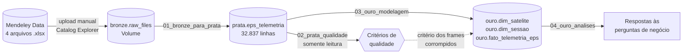

| Notebook | Lê de | Grava em | O que faz |
|---|---|---|---|
| [`01_bronze_para_prata_consolidacao`](notebooks/01_bronze_para_prata_consolidacao.ipynb) | `bronze.raw_files` (4 `.xlsx`) | `prata.eps_telemetria` | Lê cada aba de cada arquivo com pandas, padroniza as colunas, extrai a data da aba, adiciona as colunas de controle e grava a tabela consolidada |
| [`02_prata_qualidade_de_dados`](notebooks/02_prata_qualidade_de_dados.ipynb) | `prata.eps_telemetria` | — (somente leitura) | Verifica completude, consistência, unicidade e acurácia; define o critério de frames corrompidos usado na etapa seguinte |
| [`03_ouro_modelagem`](notebooks/03_ouro_modelagem.ipynb) | `prata.eps_telemetria` | `ouro.dim_satelite`, `ouro.dim_sessao`, `ouro.fato_telemetria_eps` | Constrói as dimensões e a fato, trata os frames corrompidos, valida a integridade referencial e registra o catálogo no Unity Catalog |
| [`04_ouro_analises_de_negocio`](notebooks/04_ouro_analises_de_negocio.ipynb) | tabelas `ouro.*` | — (somente leitura) | Responde às 5 perguntas de negócio com SQL e visualizações nativas do Databricks |

Ramificação: o fluxo principal é linear (bronze → prata → ouro → análise). O notebook de qualidade é uma ramificação de validação: ele não grava tabelas, mas seu resultado alimenta a modelagem. O critério `ibat_ma = 0 AND tbat_c = 0`, identificado no notebook 02, é aplicado no notebook 03 para anular as colunas de bateria.

### Etapa 1: Bronze → Prata (Extract + Transform + Load)

1. **Leitura:** para cada satélite, o arquivo é aberto com `pandas.ExcelFile` (biblioteca `openpyxl`) direto do Volume, e todas as abas são percorridas.
2. **Padronização das colunas por posição:** os cabeçalhos originais têm pequenas diferenças de digitação entre arquivos (ex.: "Time Stamp" e "Time stamp"). Por isso as 37 colunas são renomeadas pela posição, com uma lista fixa de nomes padronizados (`tpy_raw`, `tpy_c`, ...).
3. **Extração da data da aba:** a função `parse_sheet_date()` tenta vários formatos ("13 Feb 2021", "23 October 2020", "January 24 2022"...). Para as abas do TSURU sem ano ("March 28"), assume 2021, porque essas abas estão em sequência cronológica antes das abas de janeiro de 2022. Abas que não correspondem a nenhum formato (os testes em solo) recebem data nula e `is_ground_test = true`.
4. **Limpeza:** linhas totalmente em branco no fim das abas (sobra de formatação do Excel) são removidas, usando `time_stamp_s` nulo como critério.
5. **Colunas de controle:** `satellite_id`, `sheet_name`, `sheet_date`, `is_ground_test` e `source_file` são adicionadas a cada aba antes da concatenação.
6. **Tipagem:** as colunas `_raw` são convertidas explicitamente para texto antes da conversão para Spark, porque misturavam tipos (números e textos hexadecimais) e geravam `ArrowTypeError`.
7. **Carga:** o DataFrame pandas é convertido para Spark e gravado como tabela Delta gerenciada no Unity Catalog, com `mode("overwrite")`.

### Etapa 2: Qualidade (validação)

Detalhada na seção 5.

### Etapa 3: Prata → Ouro (Transform + Load)

1. **`dim_satelite`:** montada a partir de uma lista fixa de 4 linhas (conhecimento de domínio), após conferir os valores exatos de `satellite_id` na prata.
2. **`dim_sessao`:** sessões distintas da prata, com `sessao_id` gerado por `row_number()` sobre uma janela ordenada.
3. **`fato_telemetria_eps`:** *inner join* da prata com a `dim_sessao` pela chave natural. A contagem de linhas foi conferida antes e depois do join (32.837 nos dois casos, sem duplicação). Depois, seleção das 19 colunas analíticas e anulação das colunas de bateria nos frames corrompidos com `F.when()`.
4. **Validação:** `LEFT ANTI JOIN` nos dois relacionamentos (zero órfãos).
5. **Catálogo:** `COMMENT ON TABLE` e `ALTER COLUMN ... COMMENT` para as 3 tabelas, com domínios calculados por agregação sobre os dados.

**Reexecução:** todas as gravações usam `overwrite` e a chave substituta é determinística. Assim, o pipeline inteiro pode ser reexecutado do zero sem duplicar dados e produzindo sempre os mesmos IDs.

**Orquestração:** os notebooks foram executados manualmente, na ordem 01 → 02 → 03 → 04. Para um volume estático de dados (um dataset histórico, sem novas cargas) isso é suficiente. A automação com um Job do Databricks fica como trabalho futuro (seção 7).

As evidências de que as tabelas foram persistidas na plataforma estão nas Figuras 1 (bronze), 2 (prata) e 3 (ouro).

## 5. Qualidade de Dados (Etapa 4.5)

A qualidade foi verificada sobre a tabela `prata.eps_telemetria` (notebook [`02_prata_qualidade_de_dados`](notebooks/02_prata_qualidade_de_dados.ipynb)), antes da modelagem, em quatro dimensões. O princípio adotado foi diferenciar erro de dado de comportamento físico real: um painel gerando pouca energia pode ser justamente a falha que se quer detectar, e não um problema de qualidade.

### Completude

Contagem de nulos em cada uma das 42 colunas. Resultado: zero nulos em todas as colunas, exceto `sheet_date`, com 1.112 nulos.

Esses nulos foram investigados: correspondem exatamente às 1.112 linhas com `is_ground_test = true`, ou seja, às abas de teste em solo do TSURU, que não têm data de órbita. São nulos intencionais, gerados pela função `parse_sheet_date()`, e não erro de parsing. Tratamento: nenhum; as análises em órbita filtram `is_ground_test = false`.

### Consistência

| Verificação | Resultado | Situação |
|---|---|---|
| Valores de `satellite_id` | Apenas os 4 esperados (NEPALISAT 3.040, RAAVANA 2.159, TSURU 24.378, UGUISU 3.260 linhas) | OK |
| Faixa de `sheet_date` | 2020-10-23 a 2022-01-24, dentro do período de operação da constelação | OK |
| Faixa de `time_stamp_s` | 0,0 a 12.362,2 s (~3h26min), sem negativos e com duração plausível de sessão | OK |

### Unicidade

A chave natural de uma leitura é `(satellite_id, sheet_name, time_stamp_s)`. A verificação de duplicatas nessa combinação retornou zero registros duplicados, o que confirma que nenhuma aba foi lida duas vezes e que a concatenação não gerou repetições.

### Acurácia e Outliers

As estatísticas descritivas (mínimo, máximo, média e desvio padrão) das 18 colunas calibradas mostraram um caso claramente diferente: a tensão da bateria (`vbat_v`) tem média de 4,1 V e desvio padrão de apenas 0,11 V, mas mínimo de 0 V e máximo de 6,44 V.

A investigação encontrou 8 leituras suspeitas (7 do TSURU e 1 da UGUISU, todas em órbita). Em todas, a corrente e a temperatura da bateria estão exatamente em zero ao mesmo tempo. Nas 7 do TSURU a tensão também é 0; na da UGUISU, a tensão é anormalmente alta (6,44 V, acima do limite físico de uma célula de íon-lítio, aproximadamente 4,2 V).

Fisicamente, isso não é coerente: a bateria está sempre carregando ou descarregando, e a temperatura não cai para exatamente 0,0 °C junto com a corrente. A explicação mais provável é que o frame de telemetria da bateria foi perdido ou corrompido, e o valor 0 foi usado como preenchimento. O critério `ibat_ma = 0 AND tbat_c = 0` isola exatamente essas 8 linhas.

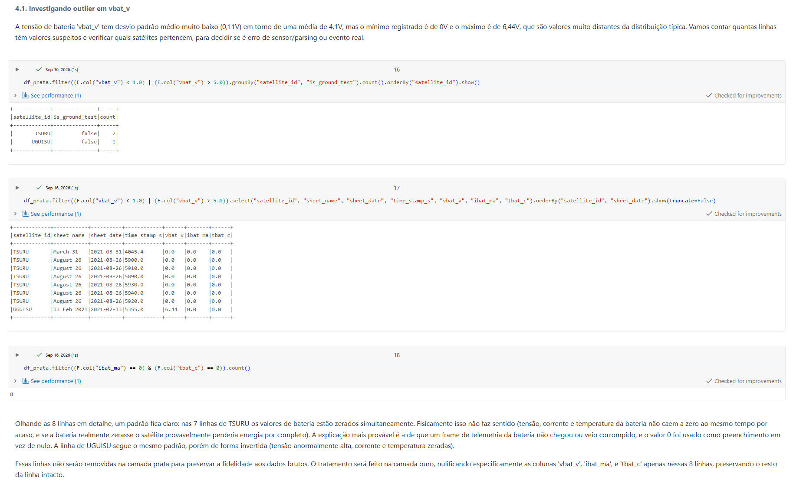

*Figura 5: Investigação do outlier em `vbat_v` no notebook de qualidade: as 8 linhas suspeitas, o critério de detecção e a decisão de tratamento.*

**Tratamento:**
- **Na prata:** as linhas foram **mantidas como estão**, para preservar a fidelidade ao dado bruto.
- **Na ouro:** apenas as 3 colunas de bateria (`vbat_v`, `ibat_ma`, `tbat_c`) foram anuladas (NULL) nessas 8 linhas. As 15 leituras de painel das mesmas linhas continuam válidas e foram preservadas. Como `AVG`, `MIN` e `MAX` ignoram nulos, as métricas de bateria da análise não são distorcidas.

Outros valores extremos que não são erro: as temperaturas de painel variam de ~-32 °C a ~92 °C, e as tensões de painel oscilam entre ~1.200 mV e ~5.700 mV. Essas amplitudes são esperadas: refletem o ciclo sol/eclipse de cada órbita e foram mantidas.

### Problema encontrado depois, na análise

Durante a análise (Pergunta 3), foi encontrada uma temperatura de bateria de -22,68 °C na UGUISU. Ela é uma única leitura, no instante 0 da sessão de 23/10/2020, isolada entre leituras acima de 0 °C. É mais um frame corrompido, mas que não foi capturado pelo critério da etapa de qualidade, porque a corrente não estava zerada. A leitura foi desconsiderada na interpretação dos resultados e registrada no catálogo da coluna `tbat_c`. A tabela ouro não foi reprocessada.

## 6. Análise de Dados (Etapa 4.5)

Todas as análises foram feitas no notebook [`04_ouro_analises_de_negocio`](notebooks/04_ouro_analises_de_negocio.ipynb), com SQL sobre as tabelas da camada ouro (fato + dimensões). 

Observação: Sessões de teste em solo foram excluídas em todas as perguntas.

Métrica de potência: para comparar geração de energia, foi calculada a potência de cada face em cada leitura, `P = V [mV] × I [mA] / 1000` (resultado em mW). A potência é mais informativa que a tensão sozinha, porque representa a energia efetivamente entregue: um painel pode ter tensão razoável e entregar pouca corrente, como a Pergunta 5 mostrou.

Limitação de cobertura: a TSURU tem 40 sessões em órbita ao longo de aproximadamente 10 meses. Os demais satélites têm apenas 2 (RAAVANA) ou 3 sessões (UGUISU, NEPALISAT). Por isso, análises de tendência temporal só são conclusivas para a TSURU.

### Pergunta 1: Como a tensão e a corrente dos painéis variam ao longo da órbita e da vida útil?

A pergunta tem duas escalas de tempo, tratadas separadamente.

a) Ao longo da órbita (minutos). Foi escolhida uma sessão longa da TSURU (28/03/2021, ~3h26min), satélite sem falha documentada, como referência de comportamento saudável.

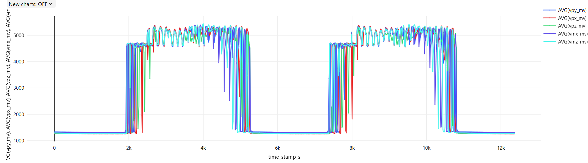

*Figura 6: Tensão das 5 faces da TSURU ao longo da sessão de 28/03/2021 (mV × segundos).*

A tensão tem forma de "onda quadrada": fica em torno de 5.000 mV com o satélite iluminado e cai para aproximadamente 1.200 mV no eclipse. A transição é rápida porque, em órbita, a sombra da Terra tem borda nítida: o satélite entra e sai do eclipse em segundos. No eclipse, a tensão não chega a zero, o que é compatível com a luz refletida pela Terra (albedo) e com uma tensão residual do circuito. A sessão tem 2 fases iluminadas e 3 de eclipse. O início de uma fase iluminada até o início da seguinte leva em torno de 5.400 s (ou 90 minutos), compatível com o período orbital de 92,6 min informado pelos autores do dataset. A oscilação rápida dentro da fase iluminada reflete a rotação do satélite, que alterna a face voltada para o Sol.

b) Ao longo da vida útil (meses). Foi calculada a tensão média das 5 faces por sessão.

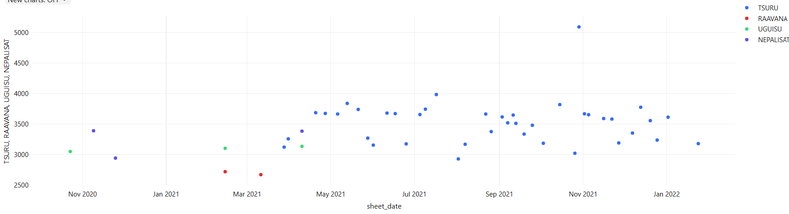

*Figura 7: Tensão média dos painéis (média das 5 faces, em mV) por sessão e por satélite, ao longo das datas de coleta.*

- **TSURU:** fica estável na faixa de ~3.100 a 3.700 mV durante os 10 meses, sem tendência de queda. Não há sinal de degradação dos painéis no período.
- **Outlier da TSURU (29/10/2021, ~5.100 mV):** nessa sessão, as cinco faces sobem juntas, o que descarta defeito em um sensor isolado. A hipótese mais plausível é um período de uma geometria em que a órbita fica iluminada continuamente, sem eclipse. A Pergunta 4 traz uma evidência independente a favor dessa hipótese.
- **RAAVANA, UGUISU e NEPALISAT:** com 2 ou 3 pontos não é possível afirmar tendência. Ainda assim, a RAAVANA tem as menores médias (em torno de 2.700 mV), o que é coerente com uma face sem gerar puxando a média das 5 faces para baixo (ver Pergunta 2).

**Corrente:** a corrente acompanha o mesmo ciclo sol/eclipse. Seu comportamento foi analisado junto com a tensão, na forma de potência, nas Perguntas 3 e 5.

**Resposta:** na escala orbital, tensão e corrente seguem o ciclo sol/eclipse, com patamares bem definidos (pico de 5.000 mV e piso de 1.200 mV). Na escala de vida útil, a TSURU não mostra degradação ao longo de 10 meses. Para os demais satélites, a cobertura de dados não permite conclusão.

### Pergunta 2: É possível identificar o momento da falha do painel (UGUISU e RAAVANA)? Quais sinais antecedem essas falhas?

A média das 5 faces dilui um problema concentrado em uma face só. Por isso foi usada a tensão máxima de cada face em cada sessão: uma face saudável atinge o pico de iluminação (5.000 mV ou mais) em algum momento da sessão, e uma face danificada, não.

| Satélite | Sessão | Máx. +Y (mV) | Máx. das outras 4 faces (mV) |
|---|---|---|---|
| RAAVANA | 13/02/2021 | 4,6 | ~5.300–5.500 |
| RAAVANA | 11/03/2021 | 4,6 | ~5.300–5.500 |
| UGUISU | 23/10/2020 | 3.110 | ~5.400–5.470 |
| UGUISU | 13/02/2021 | 3.065 | ~5.400–5.470 |
| UGUISU | 10/04/2021 | 3.034 | ~5.400–5.470 |

Observação: Nos dois satélites, a face com problema é a mesma: +Y.

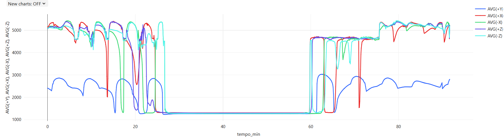

*Figura 8: Tensão das 5 faces da UGUISU na sessão de 10/04/2021 (mV × minutos). A face +Y (azul) acompanha o ciclo, mas com o teto em torno da metade das demais.*

- **RAAVANA:** a face +Y está totalmente inoperante (4,6 mV) já na primeira sessão disponível. A falha aconteceu antes da janela de dados, então não é possível localizar o momento nem observar sinais precursores.
- **UGUISU:** a face +Y ainda acompanha o ciclo sol/eclipse e tem o mesmo piso no eclipse que as outras faces (o sensor funciona), mas o teto fica em torno da metade (3.000 mV contra 5.400 mV), com leve queda entre as sessões. A análise de corrente (Pergunta 5) mostrou que o problema é mais grave do que a tensão sugere: a +Y da UGUISU entrega no máximo 65 mA, contra 500 mA nas faces saudáveis. A face está funcionalmente quase inoperante.

**Resposta:** os dados identificam com clareza qual painel falhou (+Y, nos dois satélites), mas não o momento da falha, que é anterior à primeira sessão disponível em ambos os casos. Como os dois satélites foram lançados em junho de 2019 e a primeira sessão disponível é de outubro de 2020 (UGUISU) e fevereiro de 2021 (RAAVANA), a falha aconteceu em algum ponto desses primeiros 16 a 20 meses em órbita, período não coberto pelo dataset. Quanto aos sinais, a UGUISU mostra que a tensão sozinha pode mascarar a gravidade do problema encontrado: a face ainda apresenta tensão, mas quase não entrega corrente. O indicador mais confiável para a operação em solo é a potência por face e por sessão: uma queda sustentada na potência de uma face, com as demais normais, é o sinal que devemos prestar atenção. O fato de a mesma face falhar em dois satélites do mesmo projeto também merece investigação (possível causa comum de projeto, fabricação ou montagem), embora dois casos não bastem para afirmar isso.

### Pergunta 3: Como se compara o desempenho do sistema de potência entre os quatro satélites?

O desempenho foi avaliado em duas frentes: geração (potência total das 5 faces) e armazenamento (bateria).

| Satélite | Sessões | Leituras | Potência média (mW) | Potência máx. (mW) | Vbat média (V) | Vbat mín. (V) | Tbat mín. (°C) | Tbat máx. (°C) |
|---|---|---|---|---|---|---|---|---|
| NEPALISAT | 3 | 3.040 | 1.055 | 4.184 | 4,088 | 3,87 | 1,1 | 8,7 |
| RAAVANA | 2 | 2.159 | 1.085 | 3.772 | 4,086 | 3,87 | 2,2 | 9,1 |
| TSURU | 40 | 23.266 | 1.079 | 4.378 | 4,121 | 3,79 | -0,1 | 24,4 |
| UGUISU | 3 | 3.260 | 1.022 | 3.944 | 4,095 | 3,89 | -22,7* | 6,8 |

\* Leitura espúria isolada (ver seção 5); desconsiderando-a, o mínimo da UGUISU fica próximo de 0 °C.

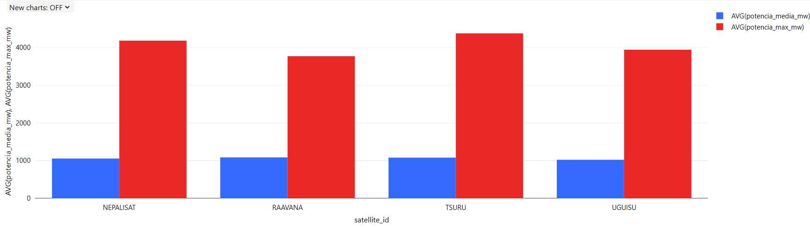

*Figura 9: Potência média (azul) e máxima (vermelho) gerada pelas 5 faces, por satélite (mW).*

- **Potência média praticamente igual (1.020 a 1.085 mW)**, inclusive na RAAVANA, que tem uma face inoperante. Há duas explicações: (1) o satélite gira, e a cada instante só algumas faces estão iluminadas, então a perda de uma face se dilui na média da órbita; (2) a geração é limitada pela demanda: com a bateria carregada, o EPS não extrai a potência máxima dos painéis. A média reflete mais o quanto o satélite precisou de energia do que o quanto ele conseguiria gerar. Por isso, a potência média não é um bom indicador de falha.
- **Potência máxima separa os satélites:** TSURU 4.378 mW, NEPALISAT 4.184 (−4%), UGUISU 3.944 (−10%) e RAAVANA 3.772 (−14%). Os dois satélites com falha têm os menores picos. Ressalva: a TSURU tem muito mais sessões, então teve mais oportunidades de registrar um pico alto.
- **Bateria saudável nos quatro:** tensão média entre 4,09 e 4,12 V (perto da carga plena de uma célula de íon-lítio, 4,2 V), e mínima nunca abaixo de 3,79 V. Temperaturas entre 0 °C e 24 °C, faixa adequada.

**Resposta:** os quatro satélites têm desempenho médio equivalente. A diferença aparece na capacidade de pico, menor nos satélites com painel falho. Mesmo com um painel comprometido, o balanço de energia se manteve positivo: a falha reduziu a margem de geração, mas não comprometeu a operação no período observado.

### Pergunta 4: Há degradação progressiva da bateria ao longo do tempo em órbita?

Com o envelhecimento, uma bateria de íon-lítio perde capacidade. Para a mesma demanda no eclipse, uma bateria degradada descarrega mais fundo, então sua tensão mínima por sessão tende a cair ao longo dos meses. Esse foi o indicador principal. A análise usou só a TSURU (40 sessões em 10 meses) justamente pelo fato de ele ser aquele que possui o maior número de registros, o que nos ajuda a ter uma ideia mais concreta a respeito do comportamento em longo prazo.

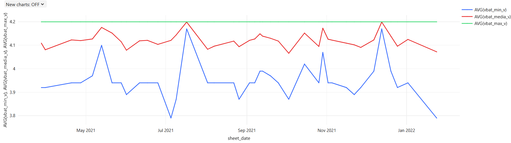

*Figura 10: Tensão mínima (azul), média (vermelho) e máxima (verde) da bateria da TSURU por sessão (V).*

- **Tensão máxima:** 4,2 V em todas as 40 sessões. A bateria atinge a carga plena do início ao fim do período.
- **Tensão mínima:** estável entre 3,87 e 3,99 V (valor mais frequente: 3,94 V), sem tendência de queda. O último ponto (24/01/2022, 3,79 V) não caracteriza tendência: o mesmo valor ocorreu em 05/07/2021, seguido de retorno à faixa normal.
- **Sessões atípicas:** em 13/05, 17/07, 29/10 e 13/12/2021, a mínima ficou próxima de 4,2 V, ou seja, a bateria praticamente não descarregou. A sessão de 29/10/2021 é a mesma do outlier de tensão dos painéis da Pergunta 1. As duas observações, feitas de forma independente, apontam para o mesmo fenômeno: um período de iluminação contínua (sem eclipse), em que os painéis geram o tempo todo e a bateria não precisa sustentar o satélite. Em 17/07 e 13/12, a temperatura média da bateria também fica bem acima do normal (24 °C contra 2–8 °C), o que reforça a hipótese de exposição solar prolongada.

**Resposta:** não há evidência de degradação progressiva da bateria da TSURU em 10 meses (cerca de 4.500 ciclos orbitais estimados).

**Limitações:** a tensão da bateria tem resolução de 0,025 V (os valores variam em "degraus"), então degradações menores que isso não são detectáveis; a tensão mínima é um indicador indireto de capacidade (a medida direta exigiria integrar a corrente ao longo de descargas completas); e os outros satélites não têm cobertura suficiente. Apesar disto, o valor de degrau é consideravelmente baixo para deixar de registrar uma degradação contínua.

### Pergunta 5: Qual face contribui mais para a geração de energia de forma consistente?

As 5 colunas de potência foram transformadas em linhas (unpivot com `stack()` do Spark SQL), e a participação de cada face no total do satélite foi calculada com uma window function (`SUM(...) OVER (PARTITION BY satellite_id)`).

| Face | NEPALISAT | RAAVANA | TSURU | UGUISU |
|---|---|---|---|---|
| +X | **24,3%** | 24,3% | 19,9% | **32,5%** |
| -X | 22,9% | 26,9% | 20,3% | 29,3% |
| +Y | 23,0% | 0,0% | **25,3%** | 0,9% |
| -Z | 20,9% | **27,5%** | 19,5% | 21,8% |
| +Z | 8,9% | 21,3% | 15,1% | 15,5% |

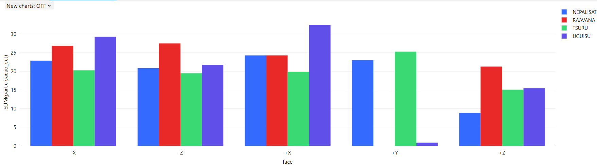

*Figura 11: Participação percentual de cada face na energia total gerada, por satélite.*

- **Nenhuma face domina sozinha.** Nas faces saudáveis, a participação fica entre 20% e 30%, o que é compatível com um satélite sem apontamento fixo para o Sol: a rotação distribui a iluminação entre as faces.
- **As faces ±X são as mais consistentes da constelação:** são as únicas que ficam entre as três maiores contribuições nos quatro satélites. A +Y lidera na TSURU, mas é justamente a face que falhou na RAAVANA e na UGUISU.
- **A face +Z é a menor contribuinte** entre as faces operacionais nos quatro satélites. Uma hipótese é que essa face tenha menos área útil de painel, pode ser que ela divida espaço com outros componentes (antenas, sensores), mas os dados não permitem confirmar isso.
- **Compensação:** nos satélites com a +Y inoperante, as outras faces geram mais que na TSURU (até 333 mW de média, contra 160–270 mW na TSURU). Como a geração é limitada pela demanda, o EPS extrai mais das faces restantes, o que explica a potência total equivalente vista na Pergunta 3.

Observação: a face +Y da UGUISU contribui com apenas 0,9%, apesar de ainda ter tensão de 3.000 mV no sol. A consulta de corrente confirmou: máximo de 65 mA (média de 4,7 mA), contra 500 mA (média de ~42–68 mA) na face +X dos quatro satélites. Esse resultado revisou a conclusão da Pergunta 2, que, olhando só a tensão, tinha classificado a face como "parcialmente degradada".

**Resposta:** as faces ±X são as contribuintes mais consistentes da constelação, e a +Z é sistematicamente a mais fraca.

### Discussão Final

As cinco perguntas se complementam e levam a algumas conclusões gerais:

1. **O EPS da constelação se mostrou robusto.** Mesmo com um painel inoperante em dois dos quatro satélites, a potência média e o estado da bateria ficaram equivalentes aos dos satélites saudáveis. A rotação distribui a geração entre as faces, e as faces restantes compensam a perda. Para a operação em solo, isso significa que a perda de um painel reduz a margem de energia, mas não inviabiliza a missão.

2. **A escolha da métrica muda a conclusão.** A média das 5 faces escondeu a falha, a tensão máxima por face mostrou qual face falhou, e só a potência (V × I) revelou a gravidade real na UGUISU. A principal recomendação para o monitoramento é acompanhar a potência máxima por face e por sessão, e não médias gerais nem tensão isolada.

3. **Evidências independentes se reforçam.** A sessão de 29/10/2021 apareceu como anômala nos painéis (P1) e na bateria (P4), com explicação coerente nos dois casos (iluminação contínua). Cruzar grandezas diferentes aumentou a confiança na interpretação.

4. **A cobertura temporal é a principal limitação.** Com 2 ou 3 sessões para três dos satélites e falhas anteriores à primeira sessão disponível, não foi possível determinar o momento das falhas nem avaliar tendências fora da TSURU. Isso é uma limitação do dataset, e não do pipeline: com mais sessões, as mesmas consultas responderiam essas perguntas sem mudanças no modelo.

## 7. Autoavaliação

### Objetivos atingidos

- O pipeline completo foi construído na nuvem (Databricks + Unity Catalog), seguindo a arquitetura Medallion: arquivos brutos intactos na bronze, tabela consolidada e auditável na prata e modelo dimensional na ouro.
- O catálogo de dados da camada ouro foi registrado de forma nativa no Unity Catalog, com descrição, tipo, domínio (calculado sobre os dados) e linhagem de cada coluna.
- A qualidade dos dados foi verificada nas quatro dimensões pedidas, e o problema encontrado (frames de bateria corrompidos) foi tratado de forma a preservar o dado bruto na prata e corrigir apenas o necessário na ouro.
- As cinco perguntas de negócio foram respondidas, com consultas SQL, visualizações e discussão dos resultados.

### Objetivos atingidos parcialmente

- **Pergunta 2:** foi possível identificar qual painel falhou, mas não o momento da falha, que ocorreu antes da primeira sessão disponível nos dois satélites.
- **Perguntas 1 e 4 (tendências):** só foram conclusivas para a TSURU. Os outros satélites infelizmente têm poucas sessões.

### Dificuldades encontradas

- **Formato dos dados brutos:** planilhas Excel com uma aba por sessão, cabeçalhos com pequenas diferenças entre arquivos e nomes de aba em vários formatos de data (alguns sem ano). A solução foi padronizar as colunas por posição e escrever uma função de parsing de datas com vários formatos.
- **Conversão pandas → Spark:** as colunas brutas misturavam números e textos hexadecimais, gerando `ArrowTypeError`. Foi resolvido convertendo explicitamente essas colunas para texto.
- **Reescrita de tabela Delta:** ao regravar a tabela prata com `overwrite`, uma coluna de uma versão anterior permaneceu no schema, com todos os valores nulos. Foi necessário remover a tabela (`DROP TABLE`) e gravá-la de novo.
- **Gráficos nativos do Databricks:** ao agrupar séries por categoria em um eixo de datas, o gráfico preenchia com zero as datas sem dados, desenhando picos falsos. A solução foi pivotar os satélites em colunas no próprio SQL e configurar o gráfico para não exibir valores nulos.
- **Revisão de conclusão:** a conclusão inicial da Pergunta 2 (face +Y da UGUISU "parcialmente degradada", baseada só na tensão) precisou ser revista depois que a análise de corrente da Pergunta 5 mostrou que a face quase não gera energia. Isso reforçou a importância de olhar mais de uma grandeza antes de concluir.

### Limitações conhecidas

- O critério de frames corrompidos (`ibat_ma = 0 AND tbat_c = 0`) não capturou uma leitura espúria de temperatura (-22,68 °C, UGUISU). Ela foi identificada e documentada, mas a camada ouro não foi reprocessada.
- A `dim_satelite` foi montada manualmente, com base na documentação da missão.
- A hipótese de iluminação contínua é coerente com os dados, mas não pode ser confirmada sem dados de órbita, que não fazem parte do dataset.
- Os notebooks são executados manualmente, na ordem.

### Trabalhos futuros

- **Capacidade da bateria:** estimar a capacidade diretamente, integrando a corrente (`ibat_ma`) ao longo de descargas completas no eclipse (coulomb counting).
- **Monitoramento operacional:** transformar a métrica de potência máxima por face e por sessão em um painel (dashboard) com alerta automático quando uma face cair abaixo de um limite em relação às demais.
